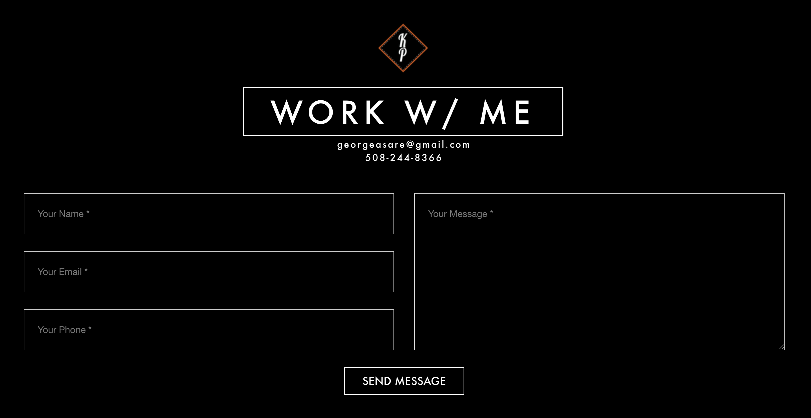

## kulgioPhotography — A portfolio <a href="https://kulgio.000webhostapp.com">website</a> for a freelance photographer. 

 

<a href="https://kulgio.000webhostapp.com">kulgioPhotography</a> is a static web page that I designed for a local freelance photographer in my hometown. The main page is one page portfolia that displays all of his photography work and allows the clients to view more images in an attached gallery. It also includes a biography area, a contact form, and even a blog. This website served as a way for me to work on and refine my front end web design skills. 
 

## Progress

Since the website is static, all changes must be made directly to the respective HTML files to update data and images. The contact form uses PHP for email submition but it's not fully operational yet. I'm still experimenting with different web technologies to improve these limitations.

 

